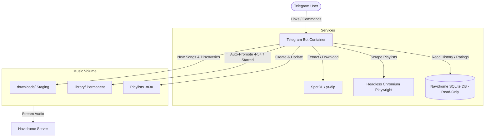

# Navidrome Telegram Bot 🎵🤖

A feature-rich Telegram bot and automated music assistant for your self-hosted **Navidrome** / Subsonic music server.

Send Spotify, YouTube, or Amazon Music links directly in Telegram, and the bot automatically fetches high-quality audio, embeds metadata and artwork, organizes your folders, and creates `.m3u` playlists ready for streaming. It also features intelligent library management, two-tier storage lifecycle, daily personalized music discovery, and storage cleanup.

---

## ✨ Features

- **Universal Multi-Platform Downloader**:
  - **Spotify**: Tracks, Albums, Playlists (via `spotdl`).
  - **YouTube & YouTube Music**: Videos, Tracks, Playlists (via `yt-dlp`).
  - **Amazon Music**: Playlists and track links using an automated headless Chromium Playwright scraper that intercepts API payloads to extract complete tracklists.
  - **Albums & Playlists**: Smart collection search that downloads every track individually with artwork and tags, generating `.m3u` playlists without stitched 1-hour jukebox files.
- **In-Chat 30s Audio Previews**:
  - Hear a 30-second audio sample with native waveform player right inside Telegram before downloading!
  - Displays up to 10 clean studio tracks with full titles, all singers, duration, and album.
  - One-tap button beneath the audio clip to download the full song directly to your library.
- **Two-Tier Storage Lifecycle**:
  - `downloads/` (Staging): Temporary staging folder for new downloads, exploratory playlists, and automated discoveries.
  - `library/` (Permanent): Safe, permanent music collection.
  - **Auto-Promotion**: Any song starred (❤️) or rated 4–5 stars in Navidrome is automatically promoted from `downloads/` to `library/`, and its relative `.m3u` playlist references are updated seamlessly.
- **Automated Daily Discovery**:
  - Runs in the background (or on-demand via `/discover`).
  - Analyzes your Navidrome listening history (most played artists and starred tracks).
  - Queries YouTube Music official radio mixes to discover fresh studio songs you haven't heard yet.
  - Downloads 1 new song per day into `downloads/` and maintains a `Daily Discovery.m3u` playlist.
- **Storage Cleanup & Space Management**:
  - Identifies tracks rated 1 star (⭐), tracks added to a `Delete` or `Trash` playlist in Navidrome, and unplayed staging tracks older than 14 days.
  - Sends an interactive Telegram card with preview and explicit confirmation buttons (`🗑️ Confirm Delete` / `❌ Cancel`) before deleting anything.
- **Modern Telegram Interface**:
  - Persistent Reply Keyboard with 1-tap quick buttons (`🎧 Discover Song`, `📊 Library Status`, `🧹 Cleanup & Sync`, `❓ Help Guide`).
  - Native Telegram slash command menu auto-registered via Telegram Bot API.
  - Real-time download progress and inline interactive buttons.
- **Multi-User Isolation**:
  - Map specific Telegram User IDs to distinct download directories so family members or friends have separate private libraries.
- **Safe Database Access**:
  - Mounts Navidrome's SQLite database in read-only mode (`mode=ro`) with full SQLite Write-Ahead Logging (WAL) support without interfering with Navidrome's active writes.

---

## 🏗️ Architecture



---

## 🚀 Quick Start

### 1. Prerequisites
- [Docker](https://docs.docker.com/get-docker/) & Docker Compose.
- A Telegram account and a bot token from [@BotFather](https://t.me/BotFather).
- Navidrome (either existing or spun up together).

### 2. Clone and Configure
```bash
git clone https://github.com/TheDayDreamer17/navidrome-telegram-bot.git
cd navidrome-telegram-bot

# Copy sample configuration
cp .env.example .env
```

Edit `.env` with your settings:
```dotenv
# Your Bot Token from @BotFather
TELEGRAM_BOT_TOKEN=1234567890:ABCdefGHIjklMNOpqrsTUVwxyz

# Comma-separated TELEGRAM_USER_ID:DOWNLOAD_DIR inside container
ALLOWED_USERS=12345678:/music/user1/downloads

# Navidrome DB path (mounted in container)
NAVIDROME_DB_PATH=/navidrome_data/navidrome.db

# Host Volume Paths
MUSIC_ROOT_DIR=/path/to/your/Music
NAVIDROME_DATA_DIR=/path/to/your/navidrome/data
```

> **How to find your Telegram User ID**: Send `/start` or any message to [@userinfobot](https://t.me/userinfobot) on Telegram.

### 3. Choose Deployment Mode

#### Option A: Companion Mode (Connect to Existing Navidrome)
If you already have Navidrome running:
```bash
docker compose up -d --build
```

#### Option B: Turnkey All-in-One Mode (Navidrome + Bot Together)
If you want Docker to run both Navidrome and the Telegram Bot in a single stack:
```bash
docker compose -f docker-compose.all-in-one.yml up -d --build
```

Inspect the logs:
```bash
docker compose logs -f
```

---

## 📱 Telegram Commands & UI

| Command / Button | Description |
| :--- | :--- |
| **Send any Link** | Paste a Spotify, YouTube, or Amazon Music track/playlist link to download immediately. |
| `/discover` or `🎧 Discover Song` | Finds a song based on your Navidrome listening history and adds it to your Daily Discovery playlist. |
| `/status` or `📊 Library Status` | Shows total tracks in `downloads/` and `library/`, and scans Navidrome for pending promotions or cleanup. |
| `/cleanup` or `🧹 Cleanup & Sync` | Runs a dry run of songs marked for removal (1⭐, `Delete` playlist, or unplayed >14d) with confirmation. |
| `/sync` | Promotes any songs rated 4–5⭐ or starred (❤️) from `downloads/` to `library/`. |
| `/help` or `❓ Help Guide` | Displays the interactive guide and supported URL formats. |

---

## ⚙️ Configuration Reference

| Variable | Default | Description |
| :--- | :--- | :--- |
| `TELEGRAM_BOT_TOKEN` | *Required* | API token from @BotFather. |
| `ALLOWED_USERS` | *Required* | Format: `ID:/path/in/container,ID2:/path2`. |
| `NAVIDROME_DB_PATH` | `/navidrome_data/navidrome.db` | Location of `navidrome.db` inside the container. |
| `UNPLAYED_EXPIRY_DAYS` | `14` | Days before an unplayed song in `downloads/` is eligible for cleanup review. |
| `DAILY_INTERVAL_SECONDS`| `86400` | Background cycle interval in seconds (24 hours). |
| `MUSIC_ROOT_DIR` | `${HOME}/Music` | Host directory where your music files are located. |
| `NAVIDROME_DATA_DIR` | `../navidrome/data` | Host directory containing Navidrome's `data/` folder. |

---

## 🔒 Security Best Practices
- Keep your `.env` file secret and never commit it to any public or private repository.
- Only authorized Telegram IDs in `ALLOWED_USERS` are permitted to execute commands or trigger downloads. All other messages from unknown IDs are rejected.
- Navidrome's SQLite database is opened with `mode=ro` (read-only) ensuring zero risk of database corruption.

---

## 📄 License
MIT License. Feel free to customize and expand for your personal music setup!
